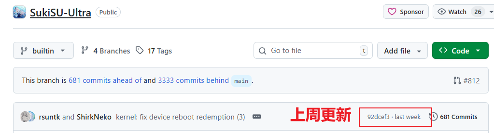
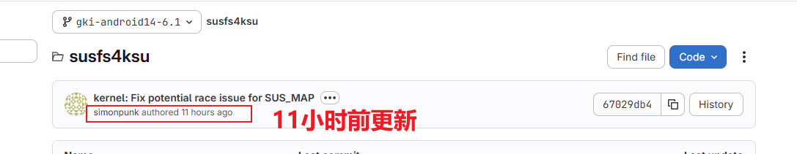
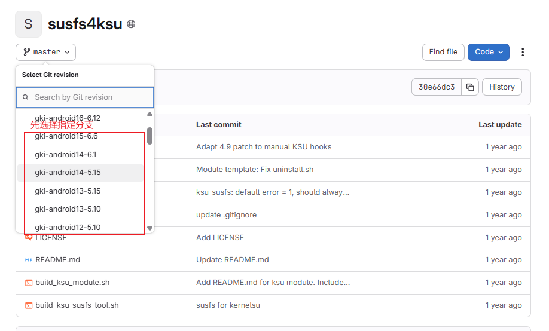
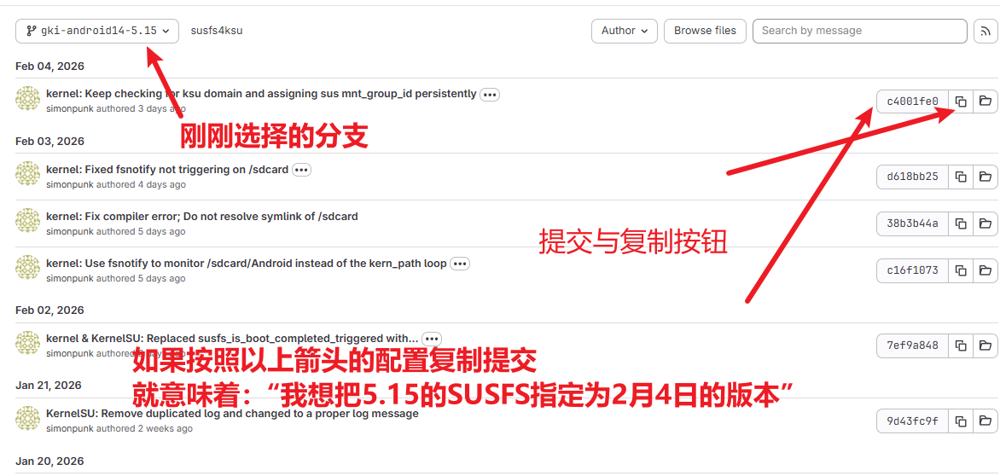

<div align="center">

# GKI KernelSU SUSFS
# 🏮 2026 🐎 Happy New Year! 🏮

**自动化构建 GKI 内核 | 集成 KernelSU + SUSFS**

[](https://github.com/zzh20188/GKI_KernelSU_SUSFS/releases)
[](http://www.coolapk.com/u/11253396)
[](https://kernelsu.org/)
[](https://gitlab.com/simonpunk/susfs4ksu)

[**English**](README-EN.md) | 简体中文

---

</div>

## 🚀 快速导航

<table>
<tr>
<td align="center" width="50%">

**📖 文档**

[GitHub Wiki](https://github.com/zzh20188/GKI_KernelSU_SUSFS/wiki)

</td>
<td align="center" width="50%">

**📥 下载**

[Releases](https://github.com/zzh20188/GKI_KernelSU_SUSFS/releases)

</td>
</tr>
</table>

---

## ⚠️ 兼容性提醒

> **注意：** 目前不支持一加 ColorOS 14、15，刷入后可能需要清除数据开机。


---

## 📚 文档与指南

详细说明请查阅 [**GitHub Wiki（中英双语）**](https://github.com/zzh20188/GKI_KernelSU_SUSFS/wiki)

Wiki 涵盖内容：
- 📥 下载/刷入内核
- 🔄 无限重启处理
- 💡 使用技巧 Tips
- 🆘 救砖指南
- 📊 内核版本兼容性说明
- **🔧 [Fork 与自定义编译指南](https://github.com/zzh20188/GKI_KernelSU_SUSFS/wiki/Fork%E4%B8%8E%E8%87%AA%E5%AE%9A%E4%B9%89%E7%BC%96%E8%AF%91%E6%8C%87%E5%8D%97)** - 学习如何 Fork 仓库并编译自己的内核
- **🧩 [自定义构建新手指南](https://github.com/zzh20188/GKI_KernelSU_SUSFS/wiki/%E8%87%AA%E5%AE%9A%E4%B9%89%E6%9E%84%E5%BB%BA%E6%96%B0%E6%89%8B%E6%8C%87%E5%8D%97)** - 面向新手的自定义构建模板
如何使用见以下视频

https://github.com/user-attachments/assets/b71dcb0d-0fcc-4ade-a734-152ab4821bbd


https://github.com/user-attachments/assets/fa60829d-dd51-420a-b55b-d01e521c739d


谷歌GKI发布地址：https://source.android.com/docs/core/architecture/kernel/gki-release-builds?hl=zh-cn

---

## ❗构建失败常见原因（SukiSU / SUSFS 更新不同步）

当以下两个分支的更新节奏不一致时，构建可能失败：

- SukiSU builtin 分支：<https://github.com/SukiSU-Ultra/SukiSU-Ultra/tree/builtin>
- SUSFS gki-android14-6.1 分支：<https://gitlab.com/simonpunk/susfs4ksu/-/tree/gki-android14-6.1?ref_type=heads>

例如：SUSFS 刚更新了新提交，但 SukiSU 的 `builtin` 分支还没跟进适配，这时打补丁/编译就容易失败。

如以下情况，只能等待SukiSU跟进，完成与SUSFS最新提交的适配。




## 🔧 自定义提交配置
通过 [`config/config`](config/config) 文件可以指定 SUSFS 和 SukiSU 使用特定的 commit。

**什么是提交 (commit)？**

提交是一串哈希字符串，代表仓库在某个时间点的状态。例如将 sukisu 设为 `4b8644515fe6d87a109129e590ccd9d33a855dca`，即使用 1 月 30 日的 SukiSU 版本编译内核。

**为什么要指定提交？**

- 当上游仓库更新引入 bug 或兼容性问题时，可回退到稳定版本
- 当 SUSFS 与 SukiSU 版本不同步导致编译失败时，可手动指定兼容的版本

**如何获取提交哈希？**

- SUSFS: https://gitlab.com/simonpunk/susfs4ksu
- SukiSU: https://github.com/SukiSU-Ultra/SukiSU-Ultra/commits/builtin/

以 SUSFS 为例，先选择分支，再复制对应提交的哈希值：




```ini
# 启用自定义提交
custom=true

# SUSFS 各分支的 commit hash
gki-android12-5.10=
gki-android13-5.15=
gki-android14-6.1=
gki-android15-6.6=

# SukiSU 的 commit hash
sukisu=
```

> 留空则使用该分支的最新提交。

---

## 🧪 伪装 `/proc/config.gz`（Stock Config）

这是一个进阶技巧，不需要在工作流里手动开关。  
构建时会自动检测 `config/stock_defconfig` 是否存在：存在则应用，不存在则跳过。

使用方法：
1. 确保设备当前是官方 ROM + 官方内核。
2. 获取设备上的 `/proc/config.gz`（可在手机端或电脑端操作）。
3. 解压后重命名为 `stock_defconfig`，上传到仓库 [`config/`](config/) 目录并提交（可直接在手机端完成）。

构建流程会自动：
- 复制到内核源码：`$KERNEL_ROOT/common/arch/arm64/configs/stock_defconfig`
- 在 `$KERNEL_ROOT/common/kernel/Makefile` 中将 `$(obj)/config_data` 规则从 `$(KCONFIG_CONFIG)` 切换为 `arch/arm64/configs/stock_defconfig`
- 使编译产物中的 `/proc/config.gz` 更贴近你的官方内核配置
---

## 🛠️ 安装后推荐

### 📦 模块推荐

<table>
<tr>
<th>模块名称</th>
<th>仓库</th>
<th>频道</th>
</tr>
<tr>
<td><b>LSPosed-Irena</b></td>
<td><a href="https://github.com/re-zero001/LSPosed-Irena">GitHub</a></td>
<td><a href="https://t.me/lsposed_irena">Telegram</a></td>
</tr>
<tr>
<td><b>Zygisk Next</b></td>
<td><a href="https://github.com/Dr-TSNG/ZygiskNext">GitHub</a></td>
<td rowspan="2"><a href="https://t.me/real5ec1cff">Telegram</a></td>
</tr>
<tr>
<td><b>TrickyStore</b></td>
<td><a href="https://github.com/5ec1cff/TrickyStore">GitHub</a></td>
</tr>
</table>

### 🔧 Xposed 模块

| 模块 | 说明 |
|:---:|:---|
| **FuseFixer** | [Unicode零宽修复模块](https://t.me/real5ec1cff/268) |

### App

| 名称 | 说明 |
|:---:|:---|
| **Scene** | [官网](https://omarea.com/#/) |
---

<div align="center">

**更多内容持续更新中...**

⭐ 如果这个项目对你有帮助，请点个 Star 支持一下！

</div>
